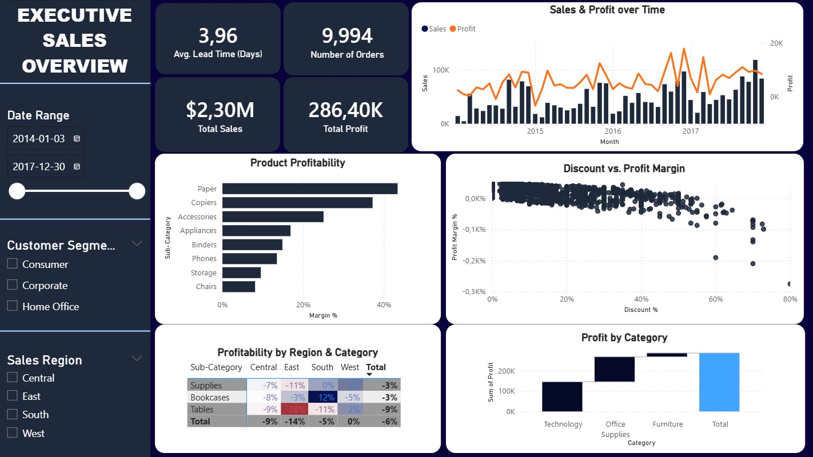

# 📊 Executive Sales & Profitability Dashboard - Power BI

## 📝 Project Overview
A comprehensive analytical dashboard created in Power BI, designed to transform raw transactional data (Superstore Dataset) into a clear and interactive tool for executive management. The report focuses on monitoring key performance indicators (KPIs), temporal trends, and identifying areas generating financial losses.

---

## 🚀 Key Features
* **Dynamic KPIs:** Tracking total sales, profit, total number of orders, and average order delivery time.
* **Trend Analysis (Sales & Profit over Time):** A combo chart (bar + line) showing the correlation between revenue and profit with a smooth, continuous timeline.
* **Regional Profitability Analysis:** A detailed matrix with conditional formatting (Heatmap), allowing for the instant localization of financial losses across specific categories and regions.
* **Scatter Plot Analysis:** Visualization of the relationship between discount rates and profit margins, facilitating the optimization of the company's discount policy.
* **Profit Structure Analysis (Waterfall Chart):** Presentation of how individual product categories contribute to the final financial bottom line.

---

## 🛠 Tech Stack & Solutions
During the project, I solved several technical challenges that significantly improved UX and data readability:

### 1. Timeline Optimization (DAX & Power Query)
The initial daily view was cluttered and required scrollbars. I applied monthly grouping to achieve a smooth trend analysis without losing timeline continuity.
> **Calculated column code:**
> `Month = STARTOFMONTH('Superstore'[Order Date])`

### 2. Advanced KPI Formatting
Standard Power BI rounding (e.g., "10K") lacked the necessary precision for the order count. I created a dedicated DAX measure, enforcing a whole number format with a thousand separator for clear visibility.
> **Measure formula:**
> `Number of Orders = COUNT('Superstore'[Order ID])`

---

## 💡 Key Business Insights
* **The Discount Trap:** The data clearly indicates that discounts above 20% drastically reduce the profit margin, rarely translating into an adequate increase in sales volume.
* **Problematic Categories:** The *Central* region shows significant losses in the *Tables* and *Bookcases* categories, suggesting an urgent need to review the supply chain, vendor contracts, or pricing strategy in this area.

---

## 📂 How to use
1. Download the `.pbix` file from the main repository folder.
2. Open the project in **Power BI Desktop**.
3. Use the filter panel on the left to dynamically change date ranges, regions, or customer segments.
